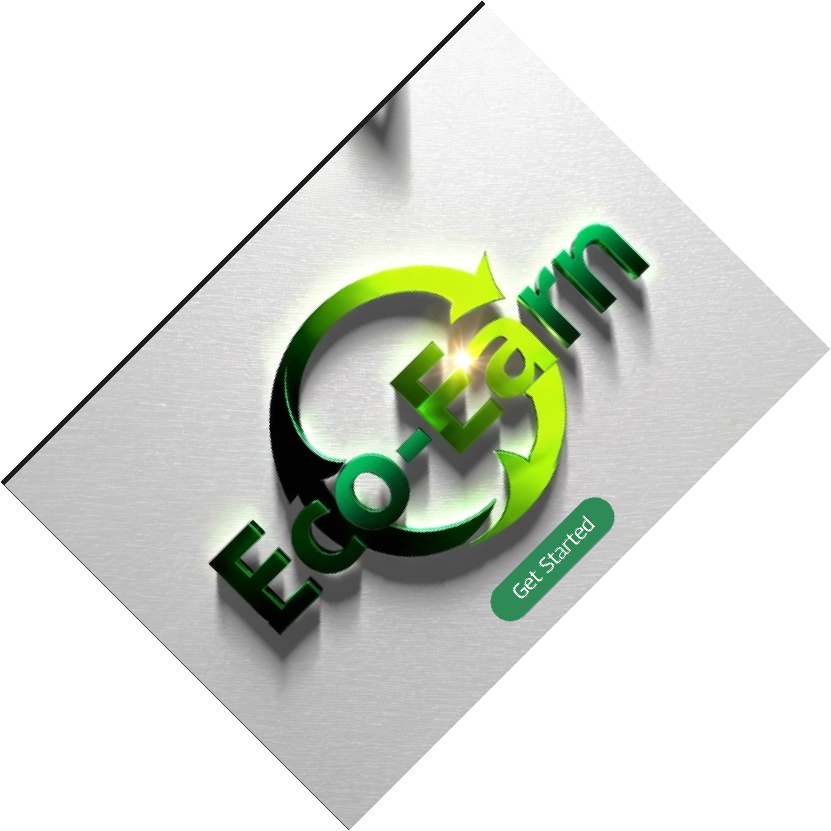
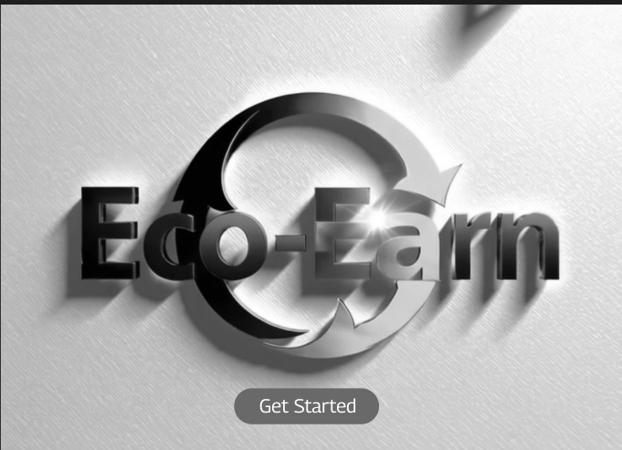

# Q4 Image Processing Outputs

This document summarizes the outputs and code snippets for `q4.py`.

## 1. Load image and print format, size, and mode
```python
from PIL import Image, ImageFilter
IMAGE_PATH = "media/Screenshot 2025-03-17 141503.png"
img = Image.open(IMAGE_PATH)
print("[1] Format:", img.format)
print("[1] Size (W,H):", img.size)
print("[1] Mode:", img.mode)
```
**Output**
```
[1] Format: PNG
[1] Size (W,H): (681, 493)
[1] Mode: RGBA
```

## 2. Convert image to grayscale
```python
gray = img.convert("L")
gray.save("gray_image.jpg")
```
Saved file: `gray_image.jpg`


## 3. Resize to 300×300 and rotate 45°
```python
resized = img.resize((300, 300))
resized.save("resized_300x300.png")
rotated = img.rotate(45, expand=True)
rotated.save("rotated_45.png")
```
Saved files: `resized_300x300.png`, `rotated_45.png`




## 4. Apply BLUR and SHARPEN filters
```python
blurred = img.filter(ImageFilter.BLUR)
sharpened = img.filter(ImageFilter.SHARPEN)
blurred.save("pil_blur.png")
sharpened.save("pil_sharpen.png")
```
Saved files: `pil_blur.png`, `pil_sharpen.png`


## 5. OpenCV image info
```python
import cv2
img = cv2.imread(IMAGE_PATH)
h, w = img.shape[:2]
ch = 1 if img.ndim == 2 else img.shape[2]
print("[5] Width:", w, "Height:", h, "Channels:", ch)
```
**Output**
```
[5] Width: 681 Height: 493 Channels: 3
```

## 6. Convert to grayscale with OpenCV
```python
gray = cv2.cvtColor(img, cv2.COLOR_BGR2GRAY)
cv2.imwrite("output_gray.jpg", gray)
```
Saved file: `output_gray.jpg`



## 7. Display original and grayscale side by side
```python
img_rgb = cv2.cvtColor(img, cv2.COLOR_BGR2RGB)
plt.figure(figsize=(8,4))
plt.subplot(1,2,1); plt.imshow(img_rgb); plt.title("Original"); plt.axis("off")
plt.subplot(1,2,2); plt.imshow(gray, cmap="gray"); plt.title("Grayscale"); plt.axis("off")
plt.tight_layout(); plt.show()
```
Produces a Matplotlib window comparing the original and grayscale images.

## 8. Half-size and center crop 100×100
```python
half = cv2.resize(img, (w//2, h//2))
cv2.imwrite("opencv_half.jpg", half)
cy, cx = half.shape[0]//2, half.shape[1]//2
crop = half[cy-50:cy+50, cx-50:cx+50]
cv2.imwrite("opencv_center_crop_100x100.jpg", crop)
```
Saved files: `opencv_half.jpg`, `opencv_center_crop_100x100.jpg`


## 9. Gaussian blur and Canny edge detection
```python
gauss = cv2.GaussianBlur(img, (5,5), 1.2)
edges = cv2.Canny(gray, 100, 200)
```
Displayed using Matplotlib with three subplots: original, Gaussian blur, and Canny edges.

## 10. Batch process images in a folder
```python
import os
from pathlib import Path
INPUT_FOLDER = "media"
OUTPUT_FOLDER = "processed_images"
Path(OUTPUT_FOLDER).mkdir(exist_ok=True)
exts = {".jpg", ".jpeg", ".png", ".bmp", ".tif", ".tiff", ".webp"}
count = 0
for name in os.listdir(INPUT_FOLDER):
    p = Path(INPUT_FOLDER) / name
    if p.suffix.lower() not in exts:
        continue
    im = cv2.imread(str(p))
    if im is None:
        continue
    g = cv2.cvtColor(im, cv2.COLOR_BGR2GRAY)
    r = cv2.resize(g, (200, 200))
    out = Path(OUTPUT_FOLDER) / f"{p.stem}_gray_200x200.jpg"
    cv2.imwrite(str(out), r)
    count += 1
print(f"[10] Processed {count} images → {OUTPUT_FOLDER}/")
```
Processes all images in `media/` and saves grayscale 200×200 versions in `processed_images/`.

