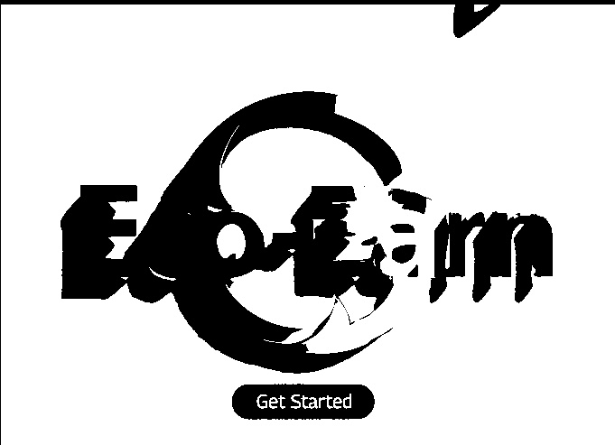
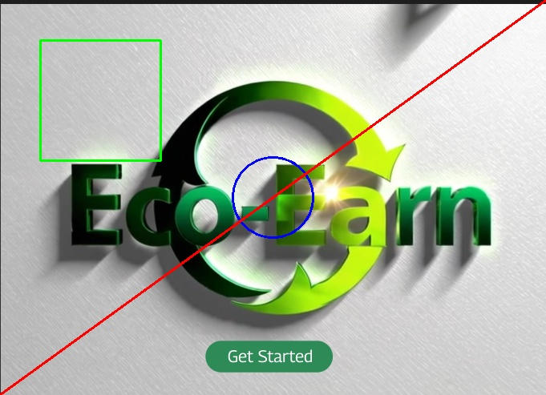
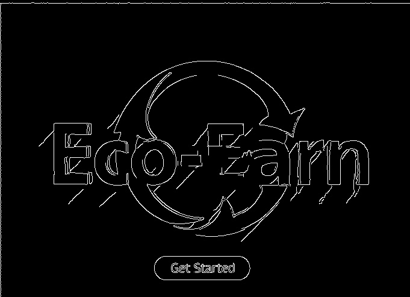

# Q5 Image Processing Tasks

This document summarizes the results and code snippets for `q5.py`.

## 1. Rotate image by 45°
```python
center = (w // 2, h // 2)
M = cv2.getRotationMatrix2D(center, 45, 1)
rotated = cv2.warpAffine(img, M, (w, h))
cv2.imwrite(f"{outdir}/rotated_45.jpg", rotated)
```
Saved file: `q5/outputs/rotated_45.jpg`


## 2. Convert color image to black & white (binary)
```python
gray = cv2.cvtColor(img, cv2.COLOR_BGR2GRAY)
_, binary = cv2.threshold(gray, 128, 255, cv2.THRESH_BINARY)
cv2.imwrite(f"{outdir}/binary.jpg", binary)
```
Saved file: `q5/outputs/binary.jpg`



## 3. Flip image horizontally and vertically
```python
flip_h = cv2.flip(img, 1)
flip_v = cv2.flip(img, 0)
cv2.imwrite(f"{outdir}/flip_horizontal.jpg", flip_h)
cv2.imwrite(f"{outdir}/flip_vertical.jpg", flip_v)
```
Saved files: `q5/outputs/flip_horizontal.jpg`, `q5/outputs/flip_vertical.jpg`


## 4. Crop the center portion of the image
```python
y1, y2 = h // 4, 3 * h // 4
x1, x2 = w // 4, 3 * w // 4
crop = img[y1:y2, x1:x2]
cv2.imwrite(f"{outdir}/center_crop.jpg", crop)
```
Saved file: `q5/outputs/center_crop.jpg`


## 5. Draw rectangle, circle, and line
```python
draw = img.copy()
cv2.rectangle(draw, (50, 50), (200, 200), (0, 255, 0), 2)
cv2.circle(draw, (w // 2, h // 2), 50, (255, 0, 0), 2)
cv2.line(draw, (0, h - 1), (w - 1, 0), (0, 0, 255), 2)
cv2.imwrite(f"{outdir}/shapes.jpg", draw)
```
Saved file: `q5/outputs/shapes.jpg`



## 6. Convert image to HSV color space
```python
hsv = cv2.cvtColor(img, cv2.COLOR_BGR2HSV)
cv2.imwrite(f"{outdir}/hsv.jpg", hsv)
```
Saved file: `q5/outputs/hsv.jpg`


## 7. Apply Gaussian blur
```python
blur = cv2.GaussianBlur(img, (7, 7), 0)
cv2.imwrite(f"{outdir}/blurred.jpg", blur)
```
Saved file: `q5/outputs/blurred.jpg`


## 8. Highlight edges with Canny edge detector
```python
edges = cv2.Canny(gray, 100, 200)
cv2.imwrite(f"{outdir}/edges.jpg", edges)
```
Saved file: `q5/outputs/edges.jpg`



